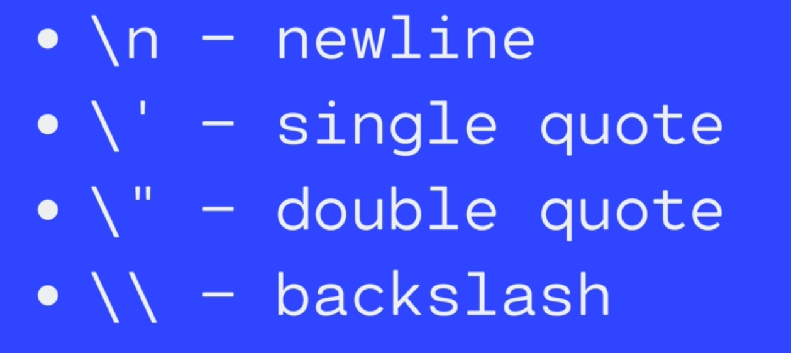

### Strings [See the tweet](https://twitter.com/umuks_/status/1358990464557473795?s=20)

Strings are pieces of text, or strings of characters. We wrap them in quotes

When you concatenate a string with a number, the result will be a concatenated string.

### Strings are Indexed

Each character has a corresponding index (a positional number)


The first character in a string has the index of zero. An we can access individual characters in a string by their indices. 

```jsx
let mySong = 'lalalalalalalalal'
console.log(mySong[1])
//That would give us the second character in the string =>a

//Strings are usually one character less than their length. So to access the last char, you will have to subtract 1
mySong[mySong.length - 1]
```

Another thing to note about strings is that they are immutable in JS. Which mean that the individual characters cannot be changed. See example below: 

```jsx
mySong[0] = 'G';
// This code will not change the first char of the string
```

If you wanted to do that, you will have to make a brand new string and a new variable and take the character and then add it to the substring. 

### String Methods

Strings come with a set of built-in methods, which are actions that can be performed on or with particular string.

We can do things like:

- Searching within a string
- Replacing parts of a string
- Changing case (upper/lowercase)

String format use the following format:

```jsx
string.methodName()
```

For example: 

```jsx
color.trim() // removes the extra spacing to the left or right of s string.
name.toUpperCase() // converts the string to upper case.
name.toLowerCase() // converts the string to lower case.
```

### String Methods with Arguments

Some methods accept arguments that modify their behaviour. We pass these arguments inside of the parenthesis.

Those values that we pass in between the parenthesis are called arguments. For example:

1. indexOf() returns a number always. If the thing you are looking for is not found, it returns -1.

```jsx
let tvShow = 'catdog';
tvShow.indexOf('cat');
//c is at index 0
tvShow.indexOf('dog');
//d is at index 3
tvShow.indexOf('z');
//Does not exist in string, so this gives -1
tvShow.indexOf('Cat');
//it is case sensitive, so this gives -1
```

2. slice()

```jsx
let school = "Ogunlade College";
school = school.slice(9)
// result => "College"
```

2. replace()

```jsx
let school = "Ogunlade College is located at surulere, lagos"
school.replace('located', 'situated');
// result: "Ogunlade College is situated at surulere, lagos"
```

### String Escape Characters



### String Template Literals

Strings that allow embedded expressions, which will be evaluated and then turned into a resulting string. You make use of backticks for this(`) 

### Null / Undefined

Null is the intentional absence of any value. It must be assigned

Undefined: Variables that do not have an assigned value are undefined. 

### Math Object

Contains properties and methods for Mathematical functions and constants. For example: 

```jsx
Math.PI // Gives us the value of PI
Math.floor(3.99999999) // cuts off the decimal value and gives us just 3.
Math.round(4.6) //Rounds up or down. This value gets rounded up to 5.
Math.pow(7,2) //Takes 7 and raise it to the second power.
Math.random() //Gives us a random decimal between 0 and 1(non-inclusive)
Math.floor(Math.random() * 10) +1 //Generates a random number between 1 and 10
```

### Equality

**DOUBLE EQUALS ==**

Checks for equality of value, but not equality of type. Because it coerces both values to the same type and then compares them.

TRIP**LE EQUALS ===**

Just like Double equals except, it checks for type too. It cares about the type and value so it would not try to coerce the values to be of a common type.

### Conditionals

IF STATEMENTS

To write logic in our code, to actually make decisions, the key mechanism we use is conditional statements.
