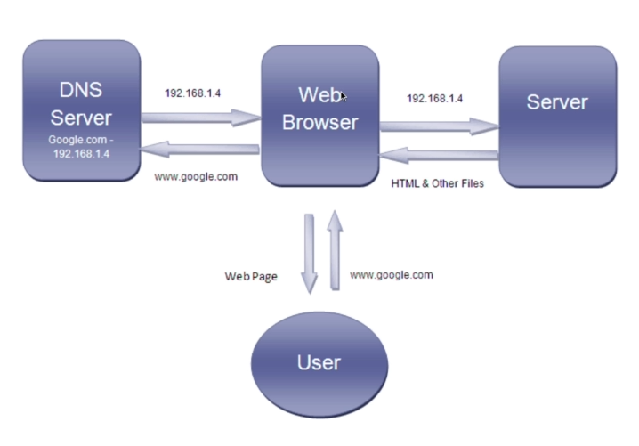

> Date: 18, April 2021. [View Tweet](https://twitter.com/umuks_/status/1375426500388851714?s=20)

### Day 61 Started HTML and CSS tutorial by Brad Traversy

---

# The Internet

The internet is just a global network of computers

Each computer/router has an IP address to uniquely identify them just like an actual address for your home.

These IP address are assigned by the ISP.

Computers talk to each other using the TCP/IP protocol.

HTTP runs over TCP. Its responsible for handling web trafic (request/response) between a browser (client) and a server.

DNS is used to map IP addresses to domain names.

## HTML

HTML is a markup language used to creating contents on a web page.

HTML has no style hence the need for CSS.

HTML is extremely important for creating websites for it is the base for every web page.

## CSS

CSS is a styling language

CSS is used to style the layout of a web page

## What can I build with HTML and CSS?

- A Static Website
- The visual part of any website
