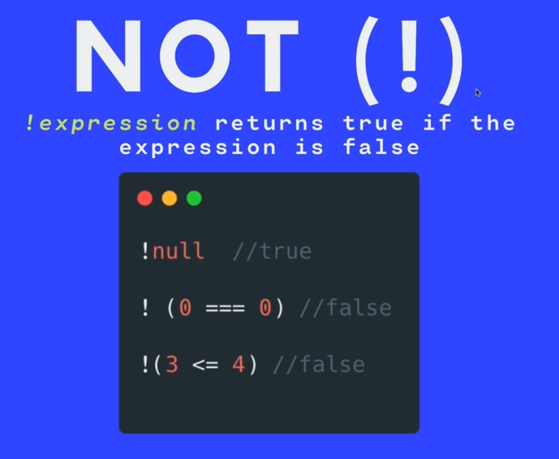
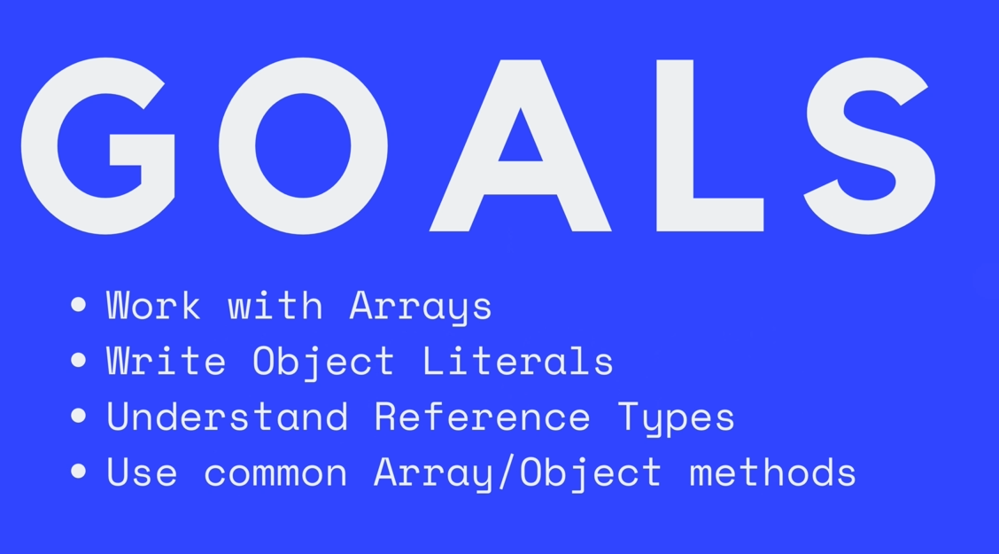

# Terminology

JS is implemented by browsers and its up to those browsers to implement new features

The way new features are added to JS is through an organization called ECMA.

ECMAScript is a specification for a programming language. A document that describes how a language should work. It is not programming language itself.

Its up to browsers to follow those rules and implement them as JS.

TC39: Technical commitee 39 of the ECMA organization is in charge of evolving and maintaining ECMAScript.

# Section 1: JS Building Blocks


## Primitive Types
- Number
- String
- Boolean
- Null
- Undefined
- Symbol and BigInt

### Number
// Comments to write notes explaining what you are doing.
Addition: +
Subtraction: -
Multiplication: *
Division: /
Modulo: %
Exponential: **

#### Order Of Operation
PEMDAS
P: Parenthesis
E: Exponential
M: Mutiplication
D: Division
A: Addition
S: Subtraction

#### NaN
Not a Number: A special value in JS. It is a numeric value that represents something that is not a number.

##### Simple ways to get NaN
- 0/0 //NaN
- 1 + NaN //NaN

## Variables
Variables lets you store information so you can recall, use and update them.

Like a jar shown below that has a value that goes into a container that has a label on it.


### Basic Syntax

#### Let
` let someName = value;
`

#### Updating variable
```
let hens = 4;

// A rat killed a hen :(
hens = hens - 1;
hens; //3
```

#### Const
Const works just like let except you cannot change the value.


### Booleans
Booleans or true or false values. This makes them efficient with the amount of space they take up


### String
Strings are pieces of text or strings or characters. We wrap them in quotes.


**Note:** Strings are immutable in JS. Which means that the individual characters of a string are not changeable. This is not the same in some other programming languages.

### String Methods
Methods are pieces of funtionality or actions that can be performed on strings or other values.

Strings come with built-in methods.

What can we do with them?
- We can search within a string
- Replace parts of a string
- Change cases (upper/lower)

```
let message = 'Do you even lift bro?'

message = message.toUpperCase();

// The value of message
"DO YOU EVEN LIFT BRO?"
```

### String Methods with arguments

#### indexOf( )
Locates the index position of specified string.


#### slice( )
Cuts out String **from** the specified string index **to** (but not required) the specified number count.


#### replace( )
Replaces on the the first occurence of the string specified in the argument.
```
'We must wash our hands, before we eat. We eat twice a day'.replace('eat', 'pray');

// What gets displayed
"We must wash our hands, before we pray. We eat twice a day"

```

### String Escapes
String combinations that hold special meaning in JS.


### String Template Literals


## NULL
Null is the intentional absence of any value.

`const reader = null`

## Undefined
Variables that do not have an assigned value.

For example, if you try to reference a variable that does not exist or has not been created,you get `undefined`.

## Math Object
Contains properties and methods for mathematical constants and functions.

# Section2: Boolean Logic
This section answers questions like:

- How do we implement decisions making in my application?
- How do we make choices in our code so that we have different outcomes when different requirements are met?
  
## GOALS For This Section

1. Understanding Comparison Operators
2. Write  Conditionals
3. Work with Boolean Operators

## Comparisons
- Greater than >
- Less than <
- Greater than or equal to >=
- Less than or equal to <=
- Equality ==
- Not equal !=
- Strict equality ===
- Non-strict equality !==

### Double equals ==
- Checks for equality of value, but not equality of type.
- It coerces both values to the same type and then compares them.
- Thi can lead to some unexpected results!

### Triple equals ===
- Checks for equality of value and type.
- Its a more specific and precise method of checking for equality.
- Its the recommended method of checking for equality

## CONDITIONALS - Making decision with code.
To add logic and make decisions in our code, we use conditional statements.

### IF Statements


### ELSE IF Statements


### Nesting


### Truthy and Falsy Values


### Logical Operators


#### AND &&
Both sides must be true in order for the statement to be true.

#### OR ||
If one side is true, the whole statement is true.

#### NOT !


#### Operator Precedence


#### Switch Cases


#### Ternary Operators
This turns an if/else statement into a single line of code.


## Section 3: Arrays and Objects




Individual piecs of information can be related to each other using data structures.

Array and Objects are two built in data structures in Javascript.

### Arrays


Array are like string because we can reference them by their index values.

But arrays are different from strings because they are mutable. ie. Their values can be changed/updated.

#### Array Methods


##### More Array Methods


