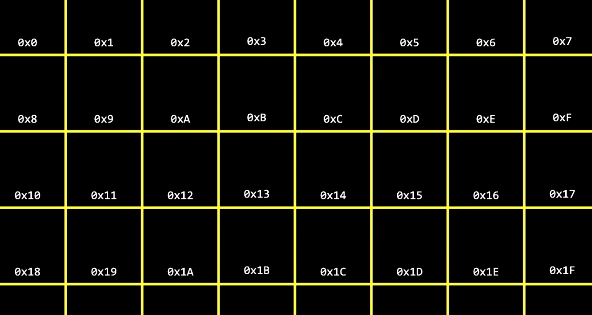
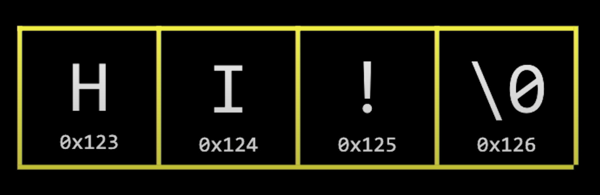

## DAY 11:

15-01-2021

(Here's the tweet!)[https://twitter.com/umuks_/status/1350167431642304516?s=20]

Continued Lecture 4 - Memory

### What is actually stored in a Computer's Memory?

Lets prefix Hex codes with **0x** to symbolize its a hex not a decimal number.



### Ampersand &

Address of operator. By prefixing any variable name, C will tell you what address the variable is stored in.

```css
int n = 50;
    printf("%p\n", &n);
```

**%p** - Prints out the address and then converts it to Hexadecimal code.

### Asterisk *

Used to tell the computer to look inside a particular memory address.

```css
int n = 50;
    printf("%p\n", *&n);
```

### Pointers

A special type of variable called pointer (%p) contains the address of some other value.

```css
int n = 50;
    int *p = &n;
    printf("%i\n", *p);
```

### Strings in Memory

Strings can be manipulated by their addresses too.



See code example below:

```css
string s = "HI";
    printf("%p\n", &s);
```

We do not need to know the full address of a string. So long as we know a string is a contiguous array of characters(that take up one byte) and ends with a \0.

All we need to know really, is the location of the first character inside the string.

In actuality, the string variable **s** is just a pointer to the first char in the memory location.

String technically does not exist as a data type in C. It instead, is more cryptically and more low-level known as:

```css
char *s = "HI!";
```

**char *variable name** - Represents the address of a character in memory.
