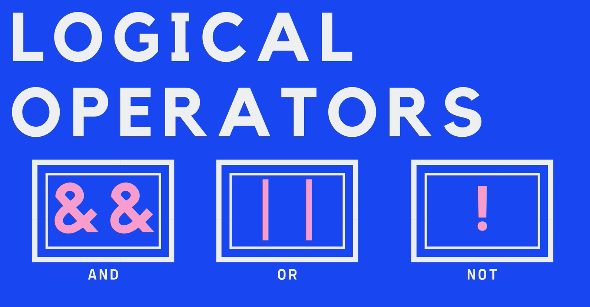

### Conditionals [TWEET HERE](https://twitter.com/umuks_/status/1359727302473572353?s=20)

IF STATEMENTS

To write logic in our code, to actually make decisions, the key mechanism we use is conditional statements. 

```jsx
let rating = 1;
if (rating === 3){
  console.log("On Thre");
}
else if (rating === 2) {
  console.log("On Two");
}
else if (rating === 1) {
  console.log("On One");
}
else {
  console.log("Invalid Rating!");
}
```

### Truthy & Falsy Values

All values have an inherent truthy or falsy boolean value.

Everything is truthy, the following are Falsy values:

- false
- 0
- ""(An Empty String)
- undefined
- NaN

### Logical Operators


### AND (&&)

Both sides must be true in order for the whole thing to be true. 

```jsx
1 <= 4 && 'a' === 'a'; //true
9 > 10 && 9 >= 9; //false
```

### OR (||)

If one side is true, the whole thing is true. 

```jsx
let age = 76;
if(age < 6 | age >= 65){
  console.log('You get in for free!');
}
else {
  console.log('You have to PaYY');
}
```
