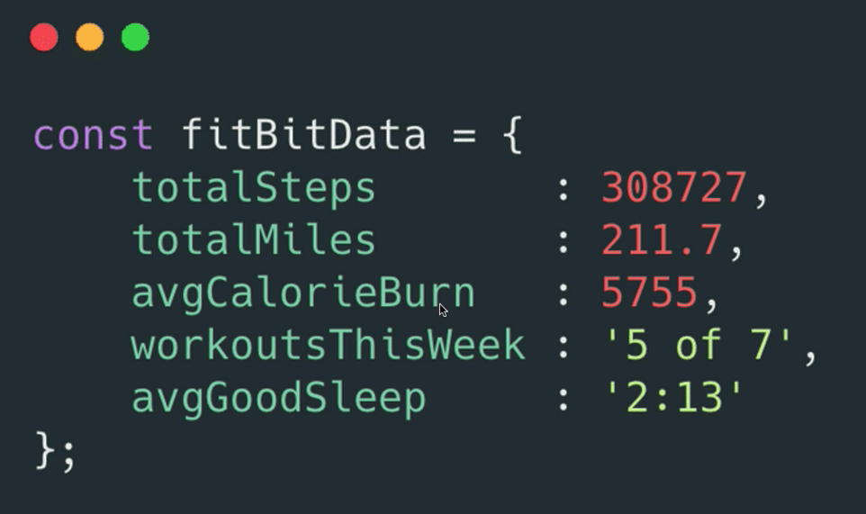

### Push and Pop

Push - add to end 

```jsx
topSongs.push('Fortunate Son');
```

Pop - remove from end 

```jsx
topSongs.pop()
```

Unshift - add to start 

```jsx
topSongs.unshift('balling');
```

Shift - remove from start 

```jsx
topSongs.shift()
```

### Concat

Concatenates two arrays, but does not mutate them, only makes a copy of the concatenated arrays. 

## Objects

An Object allows us to store data where we can associate things in group pieces of data together, rather than simply ordering data based off an index. We can specify labels.



Objects are collections of properties.

Properties are a key-value pair

Rather than accessing data using an index, we use custom keys.
